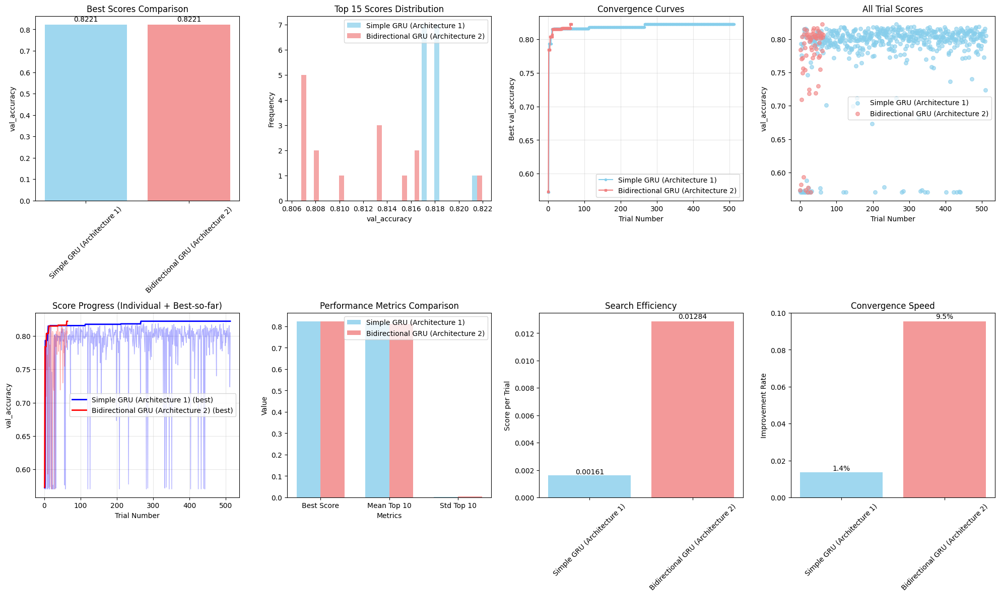
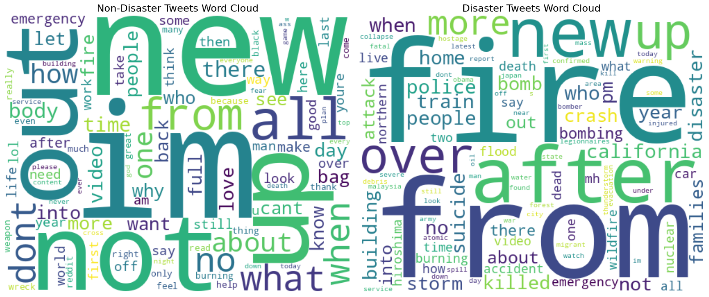
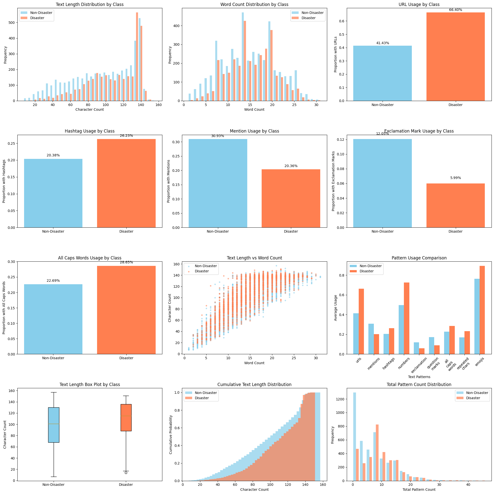

# Disaster Tweet Classification with Recurrent Neural Networks


An end-to-end NLP project that classifies tweets as referring to a **real disaster or not**, built for the Deep Learning course in the CU Boulder Master of Science in Data Science program. The project covers exploratory data analysis, a custom text-preprocessing pipeline, and two GRU-based recurrent neural network architectures tuned with Bayesian hyperparameter optimization.

**Dataset:** [Kaggle — Natural Language Processing with Disaster Tweets](https://www.kaggle.com/c/nlp-getting-started/overview) (7,613 labeled training tweets, 3,263 test tweets)

## Results

| Model | Best validation accuracy | Kaggle score (mean F1) |
|---|---|---|
| **Architecture 1** — Simple unidirectional GRU | 0.822 | **0.799** |
| **Architecture 2** — Stacked bidirectional GRU | 0.822 | 0.794 |

The headline finding: a compact single-layer GRU matched a far more complex stacked bidirectional GRU on both validation and competition data. Bayesian search diagnostics showed several hyperparameters being driven to the edges of their search ranges for both models, suggesting performance was bounded by the search space rather than model capacity — a useful caution against assuming "bigger model = better" without examining the tuning process itself.



## Project Walkthrough

The full analysis lives in a single annotated notebook: [`notebooks/disaster-tweet-classification-rnn.ipynb`](notebooks/disaster-tweet-classification-rnn.ipynb)

### 1. Exploratory Data Analysis

Systematic EDA over the target, text, keyword, and location features, including class balance, text-length distributions, and usage patterns of URLs, hashtags, mentions, and capitalization by class.

Key findings that shaped the modeling:

- Mild class imbalance (57% non-disaster / 43% disaster) — mild enough to handle without resampling.
- Disaster tweets contain URLs far more often (66% vs 41%), use more all-caps words and numbers, and use fewer exclamation marks and mentions — strong signals worth preserving during cleaning.
- `location` is missing in ~33% of rows and is highly noisy; `keyword` is nearly complete and strongly predictive (some keywords are >90% disaster-associated).

| Language differs sharply by class | Text patterns by class |
|---|---|
|  |  |

### 2. Preprocessing Pipeline

A reusable `DisasterTweetPreprocessor` class that:

- Normalizes text informed by the EDA — replaces URLs/mentions with placeholder tokens (preserving their predictive presence), processes hashtags, and normalizes repeated characters while keeping emphasis signals.
- Tokenizes with a capped vocabulary (15,000 words) and an out-of-vocabulary token.
- Pads/truncates sequences to a length chosen from the observed sequence-length distribution.

### 3. Model Architectures

Two contrasting designs, both trained with Adam on binary cross-entropy:

- **Architecture 1 — Simple GRU:** `Embedding → GRU → Dropout → Dense → sigmoid`. Five tunable hyperparameters.
- **Architecture 2 — Stacked bidirectional GRU:** `Embedding → SpatialDropout1D → 2 × Bidirectional(GRU) with batch normalization → global max + average pooling (concatenated) → regularized Dense → sigmoid`, with L2 regularization and dropout throughout. Ten tunable hyperparameters.

### 4. Hyperparameter Tuning

Each architecture was tuned with **KerasTuner Bayesian optimization** (512 trials for the simple model, 64 for the larger one) over embedding dimensions, recurrent units, learning rate, and regularization strengths, using validation accuracy as the objective. Search convergence, trial-score distributions, and search efficiency are compared visually in the notebook.

## Repository Structure

```
├── data/                  # Kaggle competition data (not committed — see data/README.md)
├── notebooks/
│   └── disaster-tweet-classification-rnn.ipynb   # Full analysis: EDA → preprocessing → models → results
├── reports/
│   └── figures/           # Key figures exported from the notebook
├── requirements.txt
└── README.md
```

## Reproducing

The notebook was developed on Kaggle with GPU acceleration and runs there as-is (attach the *NLP Getting Started* competition dataset).

To run locally:

```bash
git clone https://github.com/chernobylx/Recurrent-Neural-Net-Project.git
cd Recurrent-Neural-Net-Project
pip install -r requirements.txt

# Download the competition data (requires the Kaggle CLI and accepting the competition rules)
kaggle competitions download -c nlp-getting-started -p data/ && unzip data/nlp-getting-started.zip -d data/

jupyter notebook notebooks/disaster-tweet-classification-rnn.ipynb
```

Note: hyperparameter search (576 total trials) is compute-intensive — a GPU is strongly recommended, or reduce `max_trials` for a quick run.

## Tech Stack

**Modeling:** TensorFlow/Keras (GRU, bidirectional RNNs), KerasTuner (Bayesian optimization), scikit-learn
**Analysis & visualization:** pandas, NumPy, SciPy, Matplotlib, Seaborn, WordCloud

## Acknowledgments

- Dataset from the Kaggle [Natural Language Processing with Disaster Tweets](https://www.kaggle.com/c/nlp-getting-started/overview) competition.
- Completed as part of the Deep Learning course, CU Boulder MS in Data Science.
- Portions of the notebook code were written with the assistance of Claude Sonnet 4.
